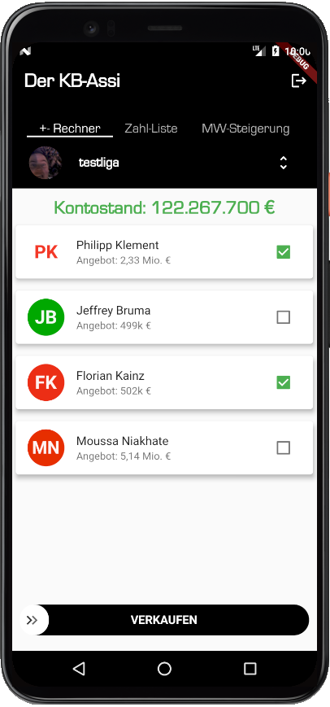

# kbAssistant

A new Flutter project. That should help kickbase user. Current features are:

## "+- Rechner"
A calculator that should give the customer support by organizing their balances to a positive number (otherwise you are not getting points for the upcoming matchday). The user can select the player to sell and sell them directly afterwards by swiping the "verkaufen" SwipeButton.

## Getting Started

This project is a starting point for a Flutter application.

A few resources to get you started if this is your first Flutter project:

- [Lab: Write your first Flutter app](https://flutter.dev/docs/get-started/codelab)
- [Cookbook: Useful Flutter samples](https://flutter.dev/docs/cookbook)

For help getting started with Flutter, view our
[online documentation](https://flutter.dev/docs), which offers tutorials,
samples, guidance on mobile development, and a full API reference.
