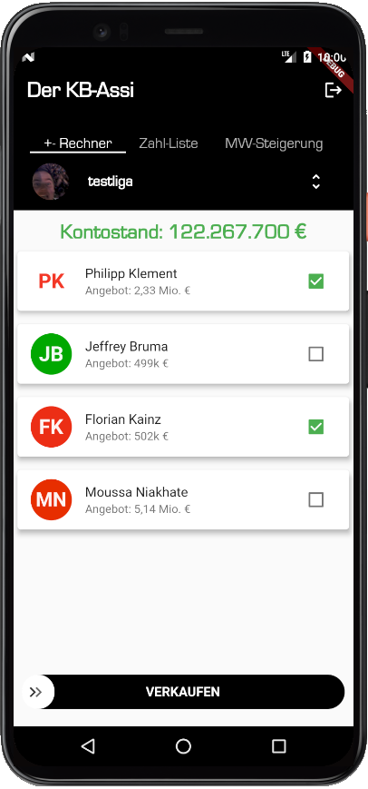
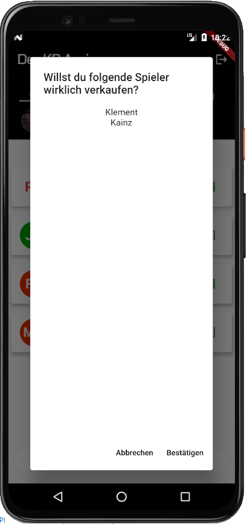
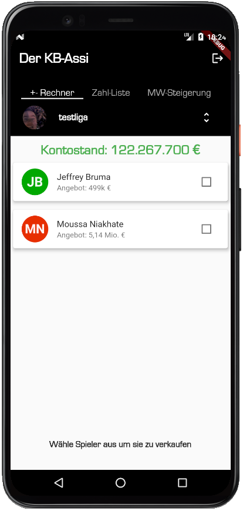
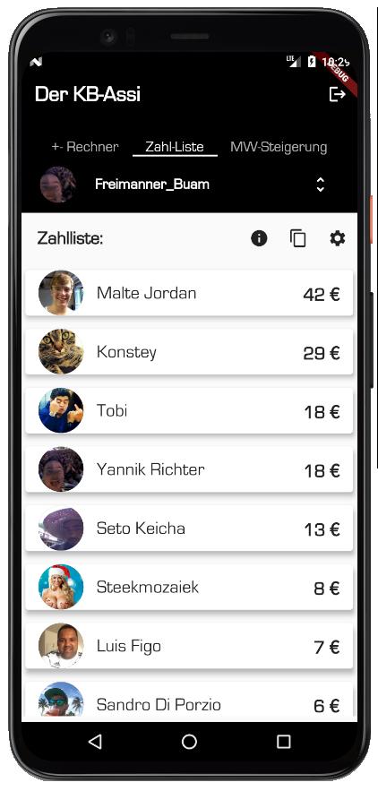
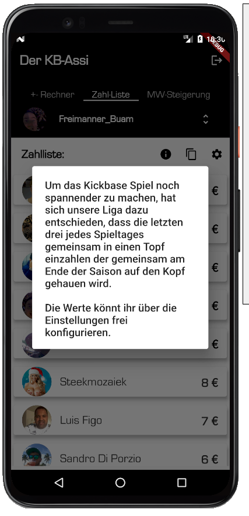
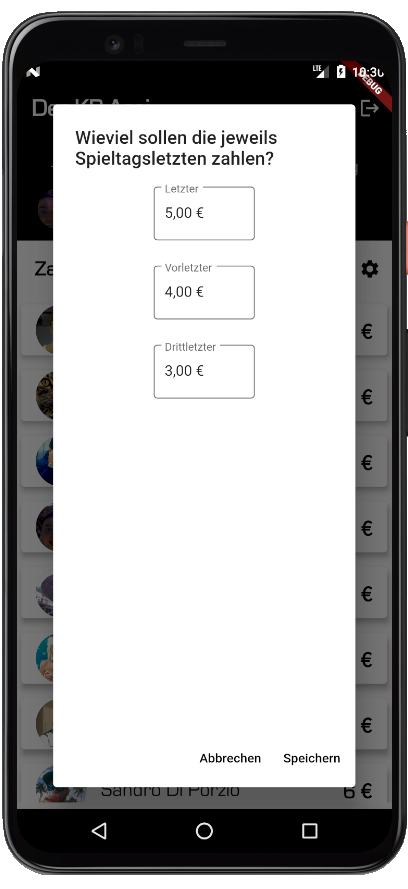
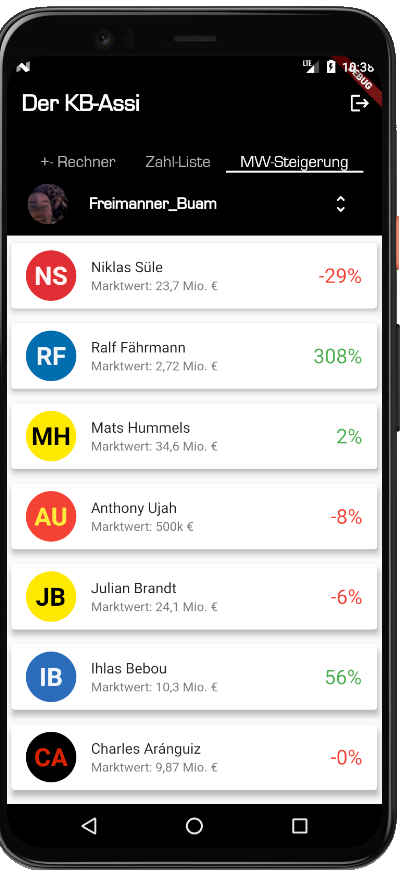
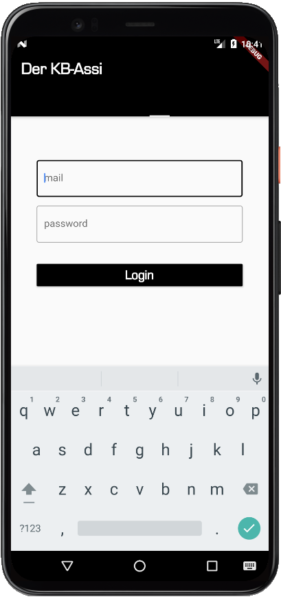
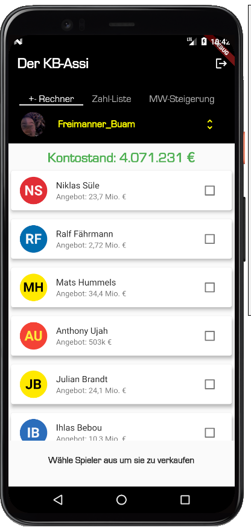
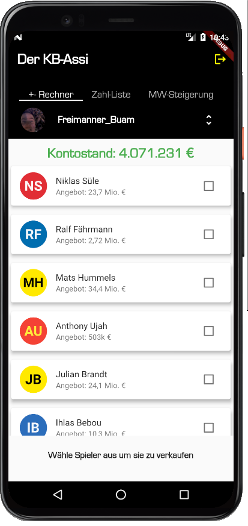

# kbAssistant

The kbAssistant / KB-Assi should help kickbase user. Currently the project ist completely in german language because kickbase just support the german "Bundesliga". The project was developed by Yannik Richter (yannik.richter@googlemail.com). The project is based on fluter. Current features are:

## "+- Rechner" / +- Calculator
A calculator that should give the customer support by organizing their balances to a positive number (otherwise you are not getting points for the upcoming matchday. 

The user can select the players to sell and sell them directly afterwards by swiping the "verkaufen" SwipeButton.

After the user accept with "Bestätigen" the player will be sold automatically and the page refreshes with the new budget and the still existing players.

## "Zahlliste" / Payment List
Background: In our league we decided to make the last three of each matchday pay an small amount that we collect until end of the season. After the last matchday we use this money to have a nice evening.

The "Zahlliste" gives an overview about the current standings of payment. In parallel you can get an short explanation to that feature, copy the list to the clipboard or configure the prices for each placement. 
  

Example for copy to clipboard output:

Zahlliste 12. Spieltag:

Malte Jordan: 42,00 € 
Konstey: 29,00 € 
Tobi : 18,00 € 
Yannik Richter: 18,00 € 
Seto Keicha: 13,00 € 
Steekmozaiek: 8,00 € 
Luis Figo: 7,00 € 
Sandro Di Porzio: 6,00 € 
ValentinS10: 3,00 €

## "Marktwersteigerung" / Marketvalue Increasement
In the "Marktwertsteigerung" section the user can get an feeling if its transfers were succesfull from a financial point of view:

## Base functionality

### Login
Just use your kickbase mail adress and password.

### Change league
Via the dropdown the user can switch between his leagues.

### Logout

Via the logout button in the top right corner the user can logout.

