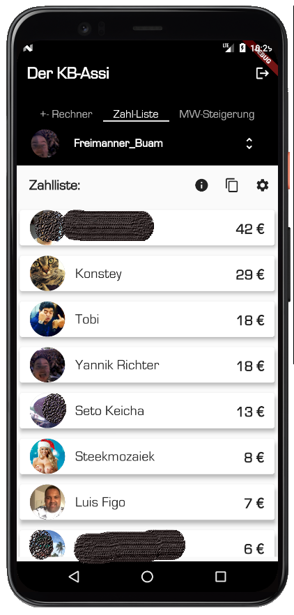

# kbAssistant

The kbAssistant / KB-Assi should help kickbase users. Currently the project is completely in German because kickbase just supports the german "Bundesliga". The project was developed by Yannik Richter (yannik.richter@googlemail.com). The project is based on flutter. Current features are:

## "+- Rechner" / +- Calculator
A calculator that supports the customer by organizing their balances to a positive number (otherwise you are not getting points for the upcoming matchday). 

The user can select players and sell them directly afterwards by swiping the "verkaufen" SwipeButton.

After the user accepts with "Bestätigen" the player will be sold automatically and the page refreshes with the new budget and shows still existing players.

## "Zahlliste" / Payment List
Background: In our league we decided to make the last three members of each matchday pay a small amount that we collect until end of the season. After the last matchday we use this money for a joined activity.

The "Zahlliste" gives an overview about the current standings of payment. In parallel you can get an short explanation to that feature, copy the list to the clipboard or configure the prices for each placement. 
  

Example for copy to clipboard output:

Zahlliste 12. Spieltag:

Player 1: 42,00 € 
Player 2: 29,00 € 
Player 3: 18,00 € 
Player 4: 18,00 € 
Player 5: 13,00 € 
Player 6: 8,00 € 
Player 7: 7,00 € 
Player 8: 6,00 € 
Player 9: 3,00 €

## "Marktwersteigerung" / Marketvalue Increasement
In the "Marktwertsteigerung" section the user can get a feeling if its transfers were succesfull from a financial point of view:

## Basic functionality

### Login
The user can use his kickbase mail address and password.

### Change league
Via the dropdown the user can switch between his leagues.

### Logout

Via the logout button in the top right corner the user can logout.

